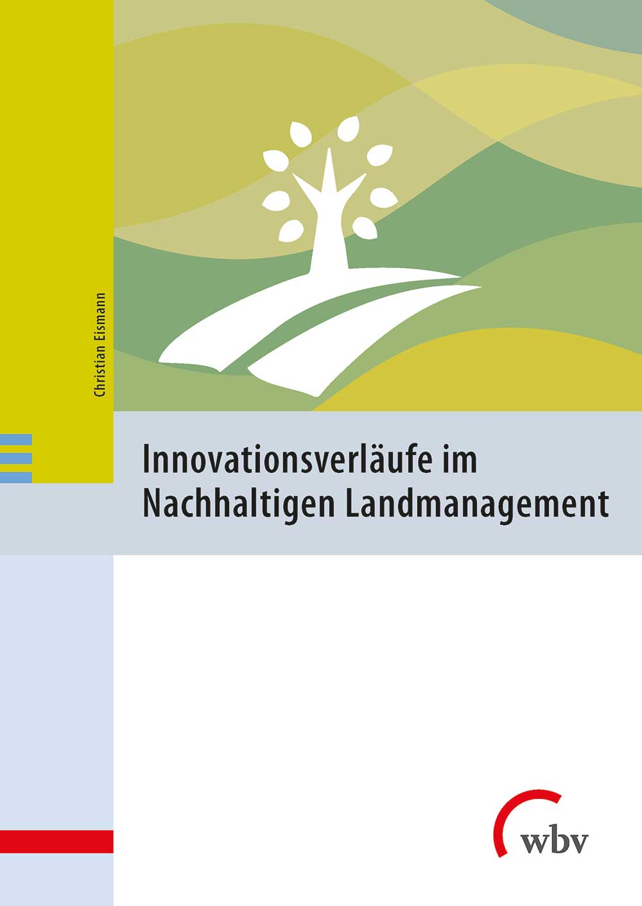

# 
innovation-metrics

## Messung von Innovationsverläufen im Nachhaltigen Landmanagement

Dieses repository beinhaltet Scripte, mit denen aus einer Reihe von Konstellationsanalysen Innovationsindikatoriken abgeleitet und visualisiert werden können, die den Fortschritt von Innovationsprozessen abbilden. Weitere Informationen und Anwendungsbeispiele finden sich im Abschlussbericht des wissenschaftlichen Begeleitvorhabens des BMBF-Förderschwerpunkts "Innovationsgruppen für ein Nachhaltiges Landmanagement":

Eismann, Christian (2022). Innovationsverläufe im Nachhaltigen Landmanagement (1. Aufl.). Bielefeld: wbv Publikation: https://doi.org/10.2378/6004919w

Konzeption, Methodik und Umsetzung: Christian Eismann

